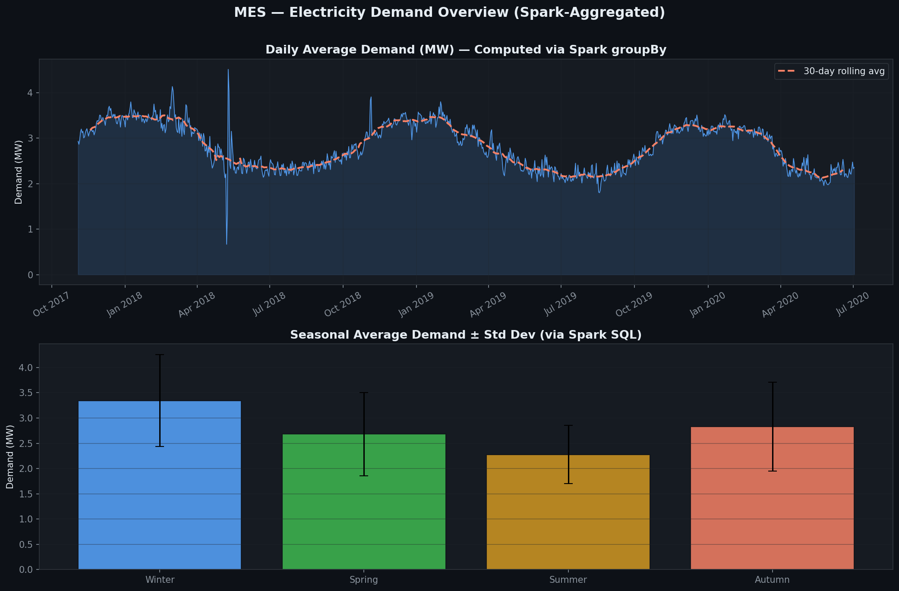
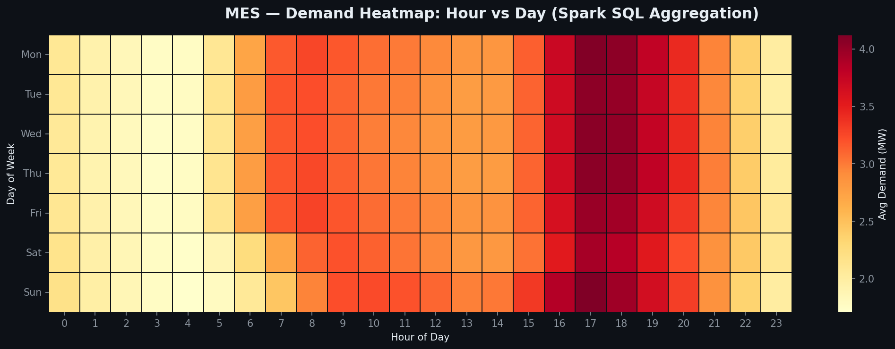
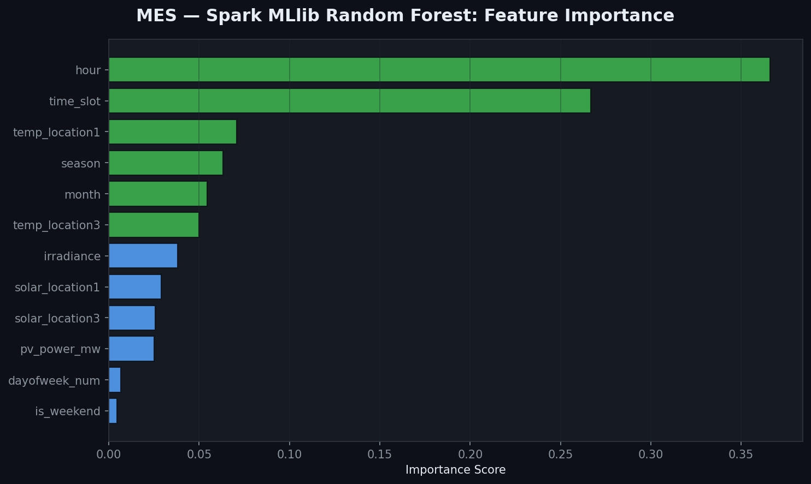
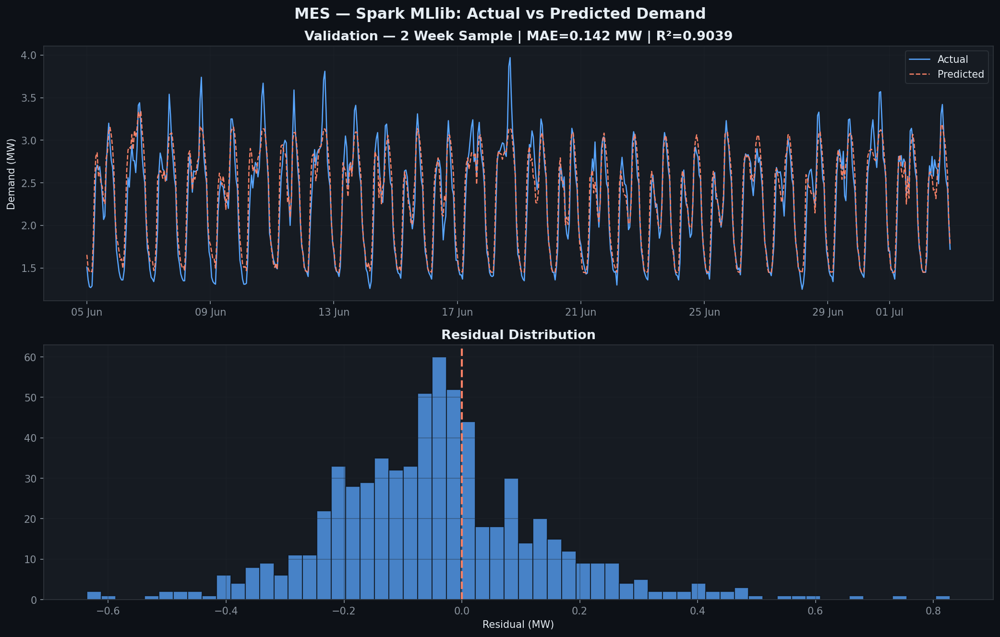

# COM7020 — Big Data for Energy Systems
### MetroEnergy Solutions (MES): PySpark Energy Analytics Pipeline

**Module:** COM7020 — Big Data and Cloud Computing  
**University:** Arden University Berlin

---

## What This Project Does

This is the Proof of Concept (PoC) for the COM7020 assignment. It builds a big data analytics pipeline for a fictional energy company — MetroEnergy Solutions (MES) — using PySpark, Spark SQL, and Spark MLlib.

The pipeline:
- Simulates a Google Cloud Storage ingestion pipeline
- Loads and processes real UK electricity demand and solar PV data using PySpark
- Runs 5 analytical queries using Spark SQL (HiveQL-style)
- Trains a demand forecasting model using Spark MLlib (Random Forest)
- Generates visualisations from Spark-aggregated results

---

## Files in This Repository

| File | Description |
|---|---|
| `Big_Data_and_Cloud_Computing.ipynb` | Main Jupyter notebook — run this |
| `plot1_demand_overview.png` | Daily demand trends and seasonal averages |
| `plot2_demand_heatmap.png` | Hour × Day demand heatmap |
| `plot3_pv_demand_correlation.png` | PV vs demand correlation by season |
| `plot4_feature_importance.png` | Random Forest feature importance |
| `plot5_actual_vs_predicted.png` | Actual vs predicted demand |

---

## Tools Used

- Python 3.10+
- PySpark 3.5.1
- Spark SQL (HiveQL-style queries)
- Spark MLlib (RandomForestRegressor)
- Google Cloud Storage library (pipeline simulation)
- Matplotlib / Seaborn
- Java 11 (Temurin JDK)
- Jupyter Notebook

---

## Dataset

Real half-hourly UK electricity demand and solar PV dataset — October 2017 to July 2020.

| File | Rows | Description |
|---|---|---|
| demand_train_set4.csv | 46,704 | Half-hourly electricity demand (MW) |
| demand_test_set4.csv | 336 | Test period demand |
| pv_train_set4.csv | 46,704 | Solar PV power and irradiance |
| pv_test_set4.csv | 336 | Test period PV |
| weather_train_set4.csv | 48,408 | Temperature and solar across 6 locations |

---

## How to Run

**Step 1 — Install Java 11**

Download from: https://adoptium.net/temurin/releases/?version=11  
Choose: Windows x64 → JDK → .msi  
During install, enable: **Set JAVA_HOME variable** and **Modify PATH variable**

Verify:
```bash
java -version
```

**Step 2 — Install dependencies**

```bash
pip install pyspark==3.5.1 findspark matplotlib seaborn google-cloud-storage
```

**Step 3 — Open the notebook**

```bash
jupyter notebook "Big_Data_and_Cloud_Computing.ipynb"
```

Run all cells from top to bottom.

---

## Model Results

| Metric | Value |
|---|---|
| Model | Spark MLlib RandomForestRegressor |
| Trees | 150 |
| MAE | 0.1425 MW |
| RMSE | 0.1897 MW |
| R² | 0.9039 |
| Top feature | Hour of day (0.369) |

---

## Sample Plots






---

## References

- Ghorbanian, M., Dolatabadi, S.H. and Siano, P. (2019) IEEE Systems Journal, 13(4), pp. 4158–4168.
- Zhou, K., Fu, C. and Yang, S. (2016) Renewable and Sustainable Energy Reviews, 56, pp. 215–225.
- Apache Spark (2024) PySpark 3.5.1 API. https://spark.apache.org/docs/3.5.1/api/python/

---

*COM7020 — Big Data and Cloud Computing | Arden University Berlin*
